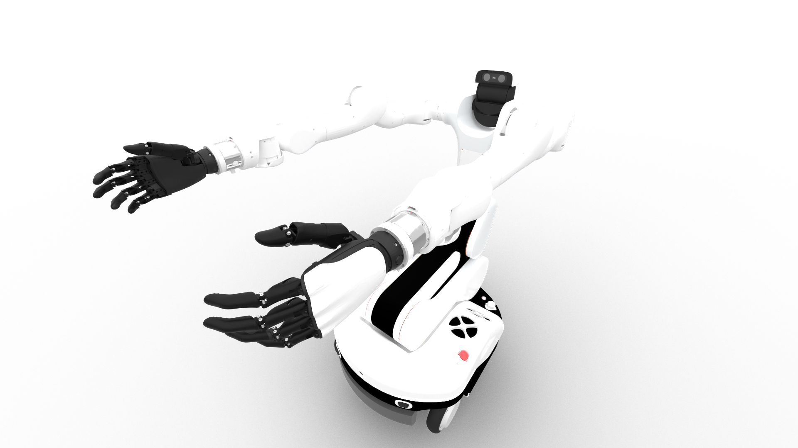
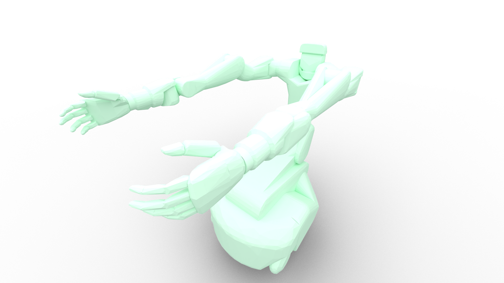
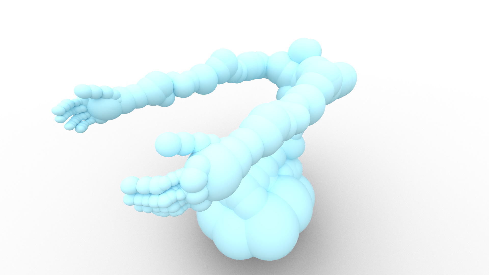

<div align="center">
  <h1>🤖 Dexmate URDF Collection</h1>
  <p>
    <strong>High-quality Robot Models for Simulation and Planning</strong>
  </p>
</div>


## 🎯 Overview

This repository contains high-fidelity robot models in Unified Robot Description Format (URDF) and Semantic Robot Description Format (SRDF). These models are essential for:

- 🎮 Robot Simulation
- 🔄 Motion Planning
- 🎨 Visualization
- 🛠️ Control System Development

## 📦 Installation

```shell
pip install dexmate_urdf
```

## 🚀 Quick Start

```python
from dexmate_urdf import robots

# Access different robot models and configurations
vega_srdf_path = robots.humanoid.vega_1.vega.srdf
vega_collision_urdf_path = robots.humanoid.vega_1.vega.collision_spheres_urdf
vega_upper_body_only_urdf_path = robots.humanoid.vega_1.vega_upper_body.urdf

# Load into your favorite simulator
load_robot(vega_upper_body_only_urdf_path)
```

## 🤖 Available Models

| Robot | Visual[^1] | Convex Collision[^2] | Sphere Collision[^3] |
|:-----------:|:----------:|:------------------:|:------------------:|
| Vega-1 |  |  |  |

[^1]: High quality visual modeling for rendering.
[^2]: Collision modeling composed of convex decomposition meshes with light simplification, which can be used for physical simulation, etc.
[^3]: Collision modeling composed of spheres, which can be an alternative collision representation when speed is more of a concern. These meshes are larger than the real one, which is not desirable to be used in high-fidelity simulation.

## 🔧 Supported Platforms

Our models are tested with popular robotics frameworks:

- 🎮 **IsaacSim/IsaacLab/IsaacGym** - For simulation and RL training
- 🔄 **Pinocchio** - For kinematics and dynamics computation
- 🎯 **SAPIEN** - For simulation and visualization

## 📚 Package Structure

```python
dexmate_urdf.robots
├── humanoid/
│   └── vega_1/
│       ├── vega.urdf            # Full robot URDF
│       ├── vega.srdf            # Semantic robot description
│       ├── vega_upper_body.urdf # Upper body only configuration
│       ├── collision.urdf       # With convex collision meshes
│       └── collision_spheres.urdf # With sphere collision meshes
└── ... # More robots
```

## 📄 Licensing

### 🔓 Apache License 2.0
This software is licensed under the **Apache License 2.0**. This permissive license allows you to:

- ✅ Use the software commercially
- ✅ Modify the software and create derivatives
- ✅ Distribute copies and modifications
- ✅ Use patent claims (if applicable)

See the [LICENSE](./LICENSE) file for the complete license text.

---

<div align="center">
  <h3>🤝 Need help with robot models?</h3>
  <p>
    <a href="https://dexmate.ai">🌐 Visit Website</a> •
    <a href="mailto:contact@dexmate.ai">📧 Contact Us</a> •
    <a href="./robots/">📚 View Robots</a>
  </p>
</div>
